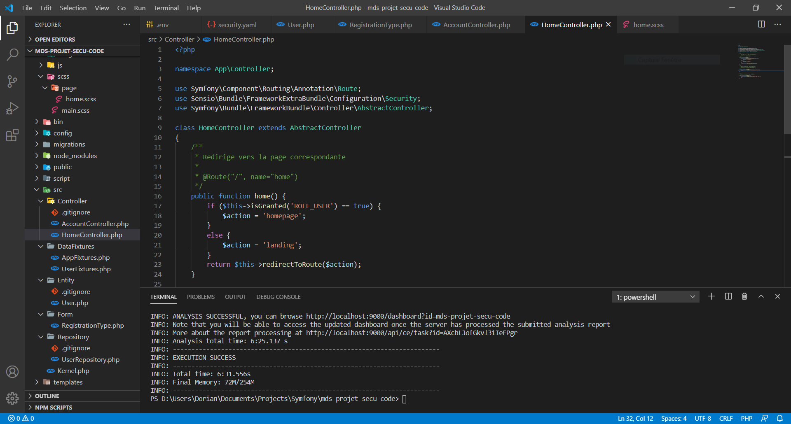
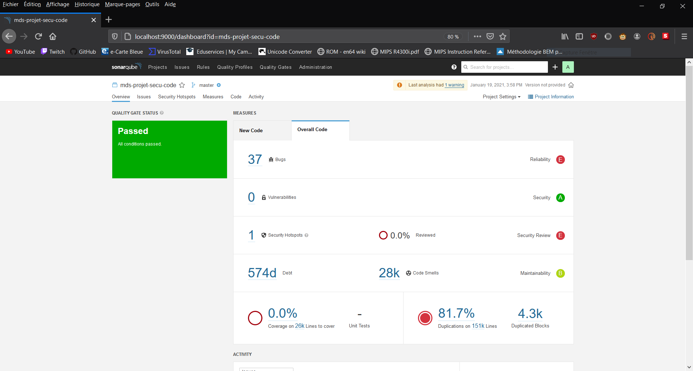
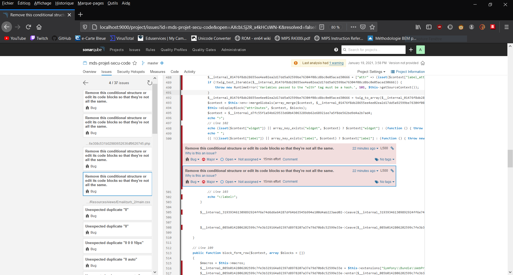

# Projet de Sécurisation du Code (Symfony 5)

Simple projet sous Symfony 5 permettant de tester l'outil de gestion de qualité du code source <b>[SonarQube](https://www.sonarqube.org/)</b>.

## Résultat d'un scan

Voici ci-dessous l'exemple d'un scan réalisé grâce à l'outil SonarQube précedemment installé sur une machine en local.

<kbd></kbd>

<kbd></kbd>

<kbd></kbd>
